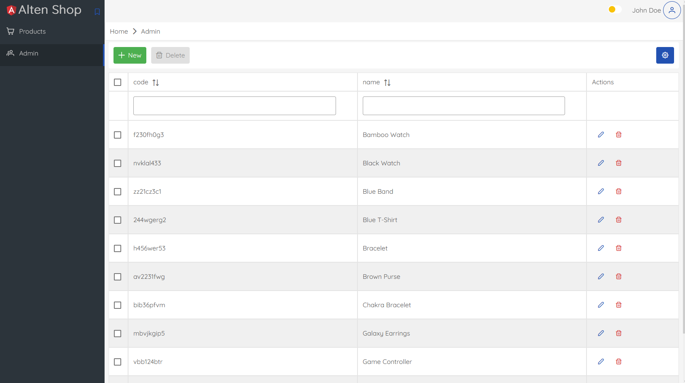
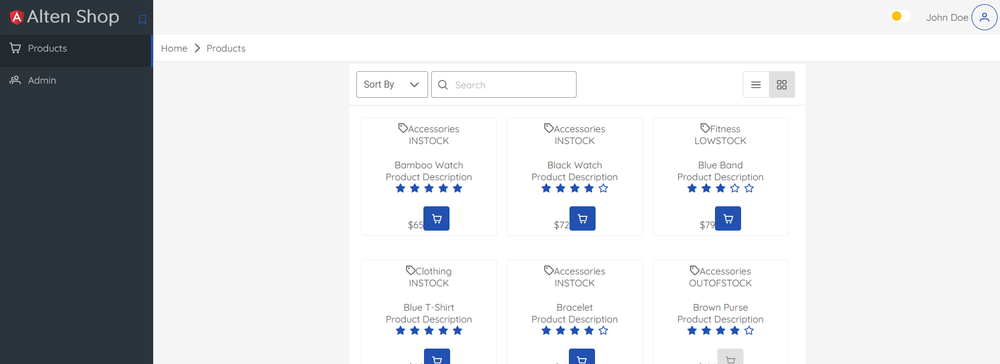

# Victor Scheidecker - Tech Lead / Fullstack Senior Engineer

## Alten Shop Project

This project's goal is to show my knowledge in creating a full-stack app.
For the purpose of this assignment I have decided to focus on the backend.
The API is build from scratch with Node, Express and Swagger and can support Sql, NoSql or File storage through 3 disctinct clients.
API can be tested and the documentation is available using Swagger.
The Front-end app was modify to show how the API is being used and display some of the data.

Feel free to send me question at vscheidecker@gmail.com.

Victor Scheidecker

### Front-end
Setup: `/front`
1. Prerequisite: NPM, Angular
2. `npm install`
3. Configure API url in `front\src\app\product\product.service.ts`. Default url is `http://localhost:3000`.
3. `npm run build`
4. `npm run start`
5. App available at http://localhost:4200

### Back-end
Setup: `/back`
1. Prerequisite: NPM, Node
2. Configure your database type and change the StorageClient accordingly in `back\src\services\products-service.ts` 
 - Sql (sqlite3): Memory db, package already part of the dependencies
 - NoSql: install MongoDB, and configure connection in `back\src\clients\nosql-storage.ts`
 - File storage
3. `npm install`
4. `npm run dev`
5. API available at http://localhost:3000

### API documentation (Swagger)
1. `npm install`
2. `npm run dev`
3. doc available at http://localhost:3000/docs


## Instructions
### Front-end

Créer un module angular "product" avec 2 composants (basés sur primeng): 
 - **products-admin** : qui liste les produits et qui permet de les administrer (ajouter, supprimer, modifier).
    Il doit être accessible à cette adresse : http://localhost:4200/admin/products
 - **products** : qui liste les produits en mode lecture seule, comme sur une boutique en ligne.
    Il doit être accessible à cette adresse : http://localhost:4200/products

Une liste de produit est disponible dans le dossier assets : `front/assets/products.json`.

Le service qui permettra de manipuler les produits doit se baser sur cette liste et être prêt à être connecté sur une API Rest ultérieurement

Le design cible est visible sur les captures d'écrans ci-dessous (et disponibles dans le dossier `front/doc`).

**Pour la partie Admin :**


Nous vous conseillons d'utiliser le composant table de [PrimeNG](https://primeng.org/table/filter) avec les options filtre, edit, page, etc...

 **Pour la partie publique :**


Nous vous conseillons d'utiliser le composant data view de [PrimeNG](https://primeng.org/dataview) avec les options sort, search, page, etc...


Le menu latéral gauche doit contenir les accès à ces 2 composants.

Un système de pagination doit être mis en place pour pouvoir afficher les produits par 10, 25 ou 50 comme ci-dessous :


### Back-end (optionnel)

Si vous avez le temps vous pouvez développer un back-end permettant la gestion de produits définis plus bas.
Vous pouvez utiliser la technologie de votre choix parmis la liste suivante :

- nodejs/express
- Java/Spring Boot
- C#/.net Core
- Python/Flask


Le back-end doit gérer les API suivantes : 

| Resource           | POST                  | GET                            | PATCH                                    | PUT | DELETE           |
| ------------------ | --------------------- | ------------------------------ | ---------------------------------------- | --- | ---------------- |
| **/products**      | Create a new products | Retrieve all products          | X                                        | X   |     X            |
| **/products/1**    | X                     | Retrieve details for product 1 | Update details of product 1 if it exists | X   | Remove product 1 |

Un produit a les caractéristiques suivantes : 

``` typescript
class Product {
  id: number;
  code: string;
  name: string;
  description: string;
  price: number;
  quantity: number;
  inventoryStatus: string;
  category: string;
  image?: string;
  rating?: number;
}
```

Le back-end créé doit pouvoir gérer les produits dans une base de données SQL/NoSQL ou dans un fichier json.

### Bonus

Vous pouvez ajouter des tests Postman ou Swagger pour valider votre API
